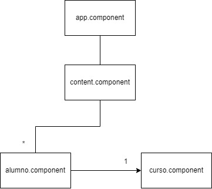

# Consigna

Entregar un proyecto que dado un array de alumnos los muestre en forma de lista y aplique diferentes estilos según algunas condiciones.

## Aspectos a incluir

- Se espera la entrega de un proyecto configurado y funcional utilizando creación de componentes
- Recuerda hacer uso correcto de directivas (estructurales y de atributo) y pipes

# Resolucion

A continuación se detalla la comunicación entre componentes y en donde se ha aplicado cada uno de los items solicitados en los aspectos a incluir

## Comunicación entre Componentes

Se tomó la desición de crear componentes, aunque solo se hizo uso de sus controladores bajo la siguiente estructura

## Directivas

### Atributo

-ngStyle: Se utlilizó la style.border para aplicarle un borde a aquellas personas mayores de 40 años de color rojo, al resto de color verde

### Estructurales

- ngFor: Se utilizó para iterar sobre el arreglo de Alumnos

### Condicionales

- ngIf: Se utilizó para aquellos alumnos de mas de 40 años, mostrando el texto **Tiene mas de 40 años! Nunca es tarde para aprender**
- ngSwitch: Se utilizó para detectar el nombre Emanuel Mosegue entre los alumnos, mostrando un texto al lado que lo indica

## Pipes

No encontré muchos casos de aplicación para usar pipes, a excepción del "debuggin" para poder determinar la estructura de un objeto e iterarla. Pero de todos modos lo utilicé como fecha de inició del curso.
